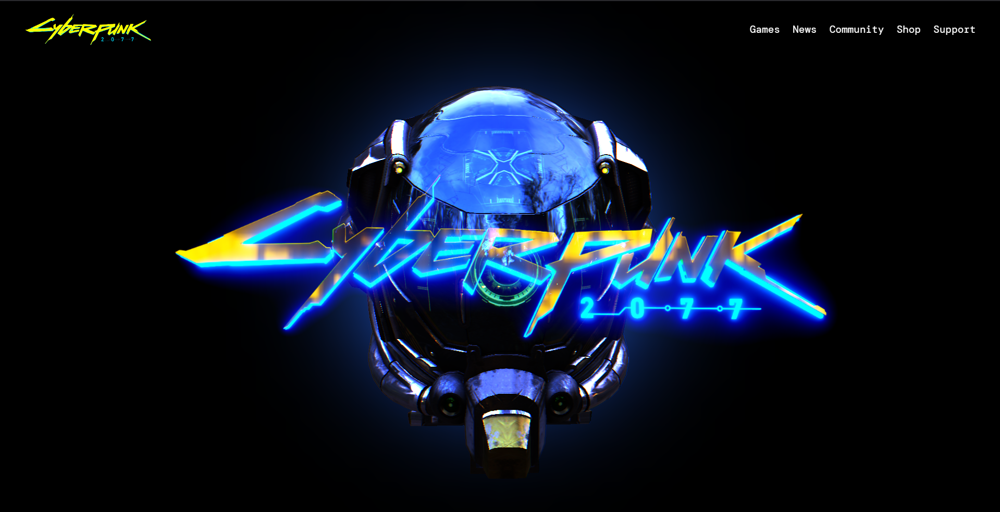

# Cyberpunk Themed Landing Page

## Overview
This project showcases a cyberpunk-themed landing page created using Three.js. The landing page features stunning visuals enhanced by custom 3D models, high dynamic range images (HDRIs), and advanced post-processing effects, providing an immersive experience.



## Features
- **Three.js Integration:** Leverages the Three.js library for 3D rendering.
- **Custom Models:** Incorporates unique 3D models designed specifically for the cyberpunk theme.
- **HDRI Backgrounds:** Utilizes high dynamic range images for realistic lighting and reflections.
- **Post-Processing Effects:** Applies various post-processing techniques for enhanced visual quality.

## Installation

1. **Clone the repository:**
   ```bash
   https://github.com/Joyxpro/Cyberpunk-Landing-Page-ThreeJs.git
   ```
   
2. **Navigate to the project directory:**
    ```bash
      cd cyberpunk-landing-page
    ```

3. **Install dependencies:**
    ```bash
      npm install
    ```

## Usage

1. Open the ``index.html`` file in your web browser.
2. Explore the interactive 3D environment.


## Customization

- **Models:** Replace the custom models in the ``models/`` directory with your own.
- **HDRI:**  Update the HDRI files in the ``hdris/`` folder to change the background.
- **Post Processing:** Modify the post-processing settings in the main JavaScript file to achieve different visual effects.

## Technologies Used

- **Three.js:** JavaScript library for creating 3D graphics in the browser.
- **Javascript:** For interactivity and functionality.
- **HTML/CSS:** For the structure and styling of the landing page.

## Acknowledgments

- [Three Js](https://threejs.org/) - The library that makes 3D graphics possible in the browser.

- [Model](https://threejs.org/examples/?q=postprocessing#webgl_postprocessing_3dlut) - This is the damaged helmet model link

- [HDRI](https://dl.polyhaven.org/file/ph-assets/HDRIs/hdr/2k/pond_bridge_night_2k.hdr) - This is the link for the 2K resolution of the HDRI
---

**Developed By :**  ``` JOY SENGUPTA ```


